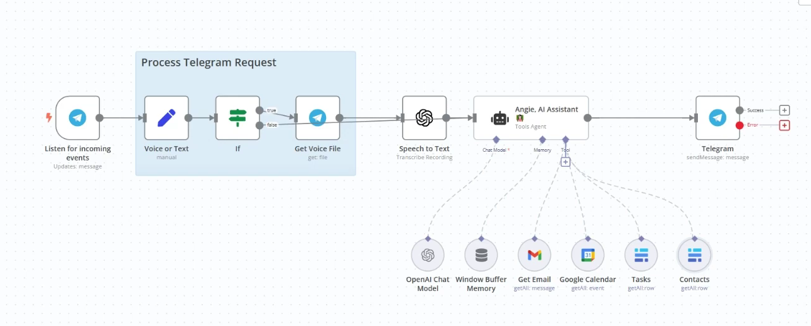

  

# Personal AI Assistant on Telegram

This is a Telegram-based AI assistant designed to streamline daily productivity tasks. The assistant can summarize emails, retrieve calendar events, manage task lists, access contact information, and interact through both text and voice messages.

---

## Overview

This project integrates AI capabilities with common productivity tools to provide a seamless assistant experience within Telegram. The system processes user queries, retrieves relevant data from connected services, and generates structured, natural-language responses.

---

## How It Works

### 1. Telegram Trigger

The workflow begins when a user sends a message to the Telegram bot.

* If the message is **text**, it is processed directly.
* If the message is **voice**, the audio file is retrieved and transcribed into text using OpenAI Speech-to-Text.

---

### 2. AI Processing

The processed input is forwarded to the AI assistant, which interprets the request and determines which connected tool should be used.

---

### 3. Integrated Tools

 This project is connected to the following services:

* **Email Retrieval** – Uses Gmail API to fetch and summarize recent emails filtered by date.
* **Calendar Lookup** – Retrieves scheduled events for specific dates.
* **Task Management** – Connects to a Baserow database to retrieve to-do items.
* **Contact Access** – Retrieves stored contact information from Baserow.

---

### 4. Response Generation

After collecting the required data, AI assistant generates a concise and structured response and sends it back to the user via Telegram.

---

## Technology Stack

* Telegram Bot API
* OpenAI API (Speech-to-Text + Language Model)
* Gmail API
* Calendar API
* Baserow Database
* Workflow Automation (e.g., n8n)

---

## Reference

This project was inspired by publicly available AI automation content and workflows shared by:

**Derek Cheung**

Engineer, instructor, and investor based in Canada

YouTube: [https://www.youtube.com/@derekcheungsa](https://www.youtube.com/@derekcheungsa)

Derek shares practical AI application development workflows and automation systems for solving real-world problems.

